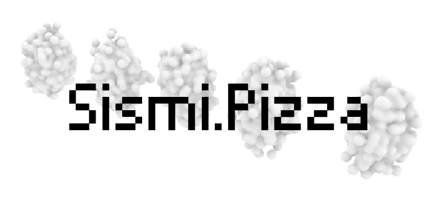

# Sismi-Project

Sismi è il prodotto di un progetto di design digitale, che si pone come principale obbiettivo quello di espandere i sensi umani mediante l'uso di dispositivi biotecnologici, i quali trasformano le micro variazioni presenti nella natura intorno a noi e li rendono percettibili dai nostri sensi.

> L'obbiettivo principale delle Bio-macchine è quello di espandere la nostra percezione del mondo e di permetterci così di poter trarne una nuova interpretazione.

## Struttura del Progetto

Il progetto prevede la realizzazione delle seguenti sezione :

1 - Landing Page : La quale ha come scopo principale di trasformare dei valori ricavati da un database, in elementi percettibili dal uomo, in particolare un grafico visivo dinamico e degli elementi auditivi a supporto. Inoltre in tale pagina si dovranno avere in tempo reali i vari dati riguardanti lo stato della macchina (GPS, Batteria, Attività).

2 - Search Box : Sempre nella landing page si ha modo di poter selezionare una data specifica dalla quale rivedere i dati, dato che essi verrano ricavati continuamente dalla macchina, data la sua autonomia.

Il progetto è ancora in fase di realizzazione, ma è possibile visitare una demo del progetto nel seguente link : _[https://sismi.francoticona.com/](https://sismi.francoticona.com/)_

## Team

Web Design : _[Lorenzo Piazzi](https://www.linkedin.com/in/lorenzopiazzi/)_

Front-End Developer : _Franco Joel Ticona Chata_

Back-End Developer : _[Arianna Parisi](https://github.com/Edward-Radical)_

## Linguaggi & Tools

1 - HTML5

2 - CSS3

3 - JavaScript

### Librerie Utilizzate

1 - [Chart.js](https://www.chartjs.org/)

2 - [Tone.js](https://tonejs.github.io/)
